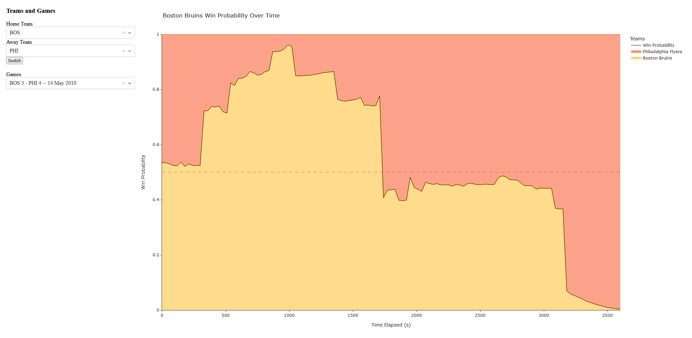

# NHL Meter
Predictive win probability for National Hockey League (NHL) games using neural networks trained on game state and play-by-play data.



<!-- ABOUT THE PROJECT -->
## About The Project

This project was originally developed alongside [Alex Hagood](https://github.com/AlexHagood) for CPT_S 475: Data Science at Washington State University taught by Assefaw Gebremedhin.
It was inspired by visualizations like ESPN's Win Probability graph for basketball and football.
Similarly, this model provides live estimates of NHL game outcomes.

The play-by-play data is sourced directly from the NHL API using [hockey-scraper](https://github.com/HarryShomer/Hockey-Scraper) and represents every in-game event between the 2007-2008 and 2023-2024 seasons.

Additional libraries include:
- [Keras](https://keras.io/) and [TensorFlow](https://www.tensorflow.org/) for neural networks implementation.
- [Dash](https://dash.plotly.com/) and [Plotly](https://plotly.com/) for web dashboard and visualization.

### Implementation

The three regulation periods of each game are divided into 30 second time slices representing the game state at the end of each interval, including each team's Elo, total score, shots on goal, hits, strength, and penalty minutes.
Regulation and overtime periods are split into sliding windows of 3 plays to determine the plays leading to scoring opportunities for golden goal overtime.
Slices and plays are fed into their own LSTM neural network to separately calculate regulation and overtime win probabilities, which are concatenated for the final graph.

The Dash app allows users to generate graphs by filtering by Home and Away Teams, then selecting a Game from the dropdown.

<!-- USAGE -->
## Usage

Built and tested with Python 3.11.9 but may support other versions.

### Installation

To just run the dashboard with the included data and models, install packages from [requirements.txt](./requirements.txt)
```sh
pip install -r requirements.txt
```

To scrape and clean the NHL data and retrain the models, install both [requirements.txt](./requirements.txt) and [requirements-dev.txt](./requirements-dev.txt)
```sh
pip install -r requirements.txt requirements-dev.txt
```

### Running the Dash App

```sh
python app.py
```

The web app will be available at `http://localhost:8050/`

### Docker

The container uses the `python:3.11.9-slim` image and installs packages required for prediction and visualization.

```sh
docker build -t nhl-meter .
docker run -h localhost -p 8050:8050 -d nhl-meter
```

### Scraping, Cleaning, and Training

1. Scrape play-by-play and shift data from NHL API.
    Note that this may take multiple days to complete
    ```sh
    python ./dev/data/scrape.py
    ```
2. Handle raw data
    ```sh
    python ./dev/data/raw_to_reduced.py
    ```
3. Train the regulation model using [lstm.ipynb](./dev/lstm.ipynb) and the overtime model using [lstm_ot.ipynb](./dev/lstm_ot.ipynb).
    The new models are ready to be used with the dashboard.
